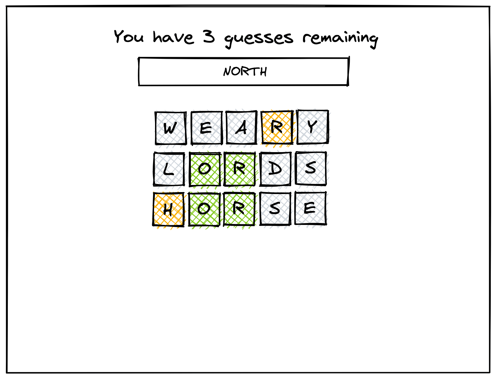

# Wordle game

A wordle game built using svelte


The premise is simple: every day there's a new five-letter secret word, and the user has to guess it. They have six tries, and with every try they get some feedback on each letter of the submitted word:

- If the letter is present in the word, it will be highlighted yellow
-If the letter is present in the word AND in the correct position, it will be highlighted green
- If the letter is not present in the word, it will be greyed out
- The user wins if they correctly guess the word within six tries.

## Task:

You'll be implementing a basic version of the original Wordle game, with the following requirements:

- User can enter guesses via the input
- User can submit a guess by pressing ENTER while focused on the input
- User receives feedback on a guess in the form of highlighted letters (see description above)
- User should see how many guesses they have remaining
- If the user correctly guesses within six tries, user should receive a success message: "You correctly guessed the word in N tries!"
- If the user does not correctly guess within six tries, user should be informed what the word was: "The word was '______'"
- Repeat letters in both the word and guess should be handled correctly
- Submissions with repeat letters should provide valid feedback (e.g. daily word='baring', submitted word='abbey', the 'a' and the first 'b' should be highlighted yellow).





## API endpoints


Get the word of the day

Method: GET
URL: https://api.frontendeval.com/fake/word
Example response: north


Check if a word is in the 5-letter word dicrionary

Method: POST
URL: https://api.frontendeval.com/fake/word/valid
Example request: 
```
{ word: 'alien' }
```
Example response: true


## Additional challenges

Remove the text input and replicate the input of the original Wordle game. When the user loads the page they should be able to begin typing immediately without needing to focus on an input

Keep track of the letters used as in the original Wordle game. How you display this is up to you.

Save the state of the game so that the user can continue where they left off if they reload the page. Make sure the game resets when the word resets the next day.

## Get started

Install the dependencies...

```bash
cd svelte-app
npm install
```

...then start [Rollup](https://rollupjs.org):

```bash
npm run dev
```

Navigate to [localhost:8080](http://localhost:8080). You should see your app running. Edit a component file in `src`, save it, and reload the page to see your changes.

By default, the server will only respond to requests from localhost. To allow connections from other computers, edit the `sirv` commands in package.json to include the option `--host 0.0.0.0`.

If you're using [Visual Studio Code](https://code.visualstudio.com/) we recommend installing the official extension [Svelte for VS Code](https://marketplace.visualstudio.com/items?itemName=svelte.svelte-vscode). If you are using other editors you may need to install a plugin in order to get syntax highlighting and intellisense.

## Building and running in production mode

To create an optimised version of the app:

```bash
npm run build
```

You can run the newly built app with `npm run start`. This uses [sirv](https://github.com/lukeed/sirv), which is included in your package.json's `dependencies` so that the app will work when you deploy to platforms like [Heroku](https://heroku.com).


## Single-page app mode

By default, sirv will only respond to requests that match files in `public`. This is to maximise compatibility with static fileservers, allowing you to deploy your app anywhere.

If you're building a single-page app (SPA) with multiple routes, sirv needs to be able to respond to requests for *any* path. You can make it so by editing the `"start"` command in package.json:

```js
"start": "sirv public --single"
```

## Using TypeScript

This template comes with a script to set up a TypeScript development environment, you can run it immediately after cloning the template with:

```bash
node scripts/setupTypeScript.js
```

Or remove the script via:

```bash
rm scripts/setupTypeScript.js
```

If you want to use `baseUrl` or `path` aliases within your `tsconfig`, you need to set up `@rollup/plugin-alias` to tell Rollup to resolve the aliases. For more info, see [this StackOverflow question](https://stackoverflow.com/questions/63427935/setup-tsconfig-path-in-svelte).

## Deploying to the web

### With [Vercel](https://vercel.com)

Install `vercel` if you haven't already:

```bash
npm install -g vercel
```

Then, from within your project folder:

```bash
cd public
vercel deploy --name my-project
```

### With [surge](https://surge.sh/)

Install `surge` if you haven't already:

```bash
npm install -g surge
```

Then, from within your project folder:

```bash
npm run build
surge public my-project.surge.sh
```
